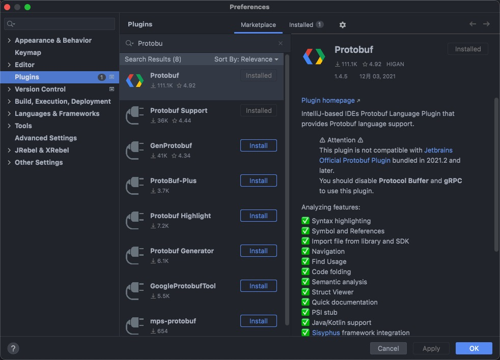
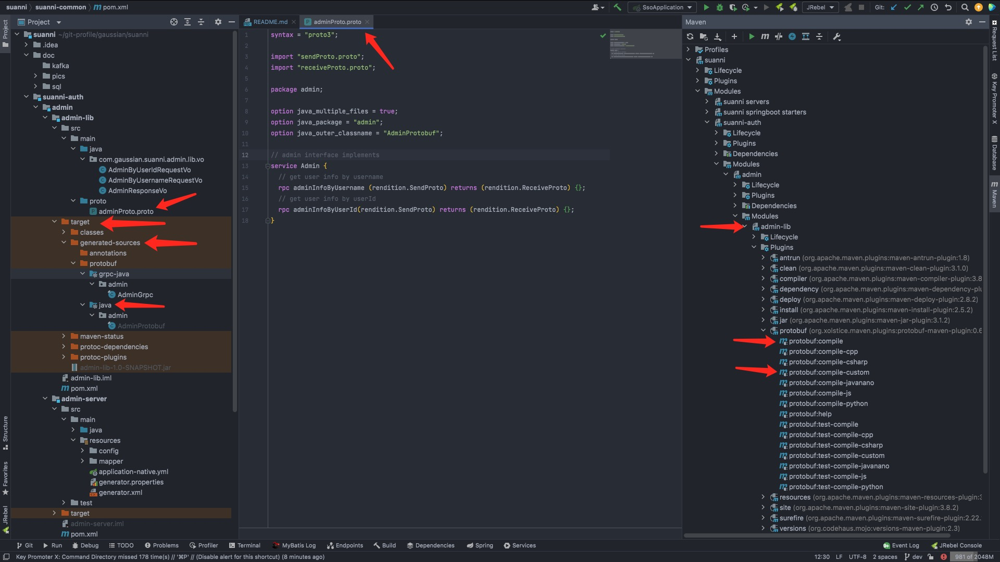
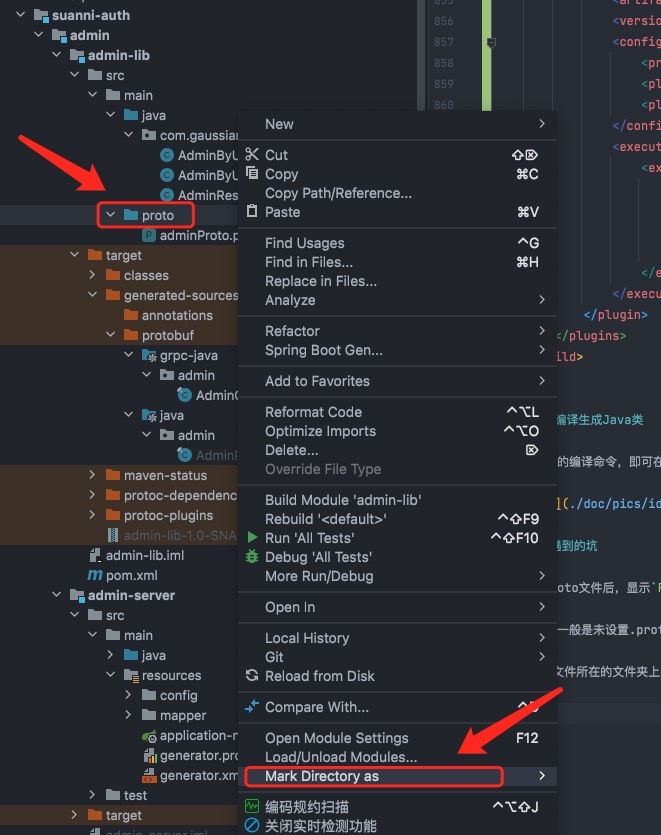
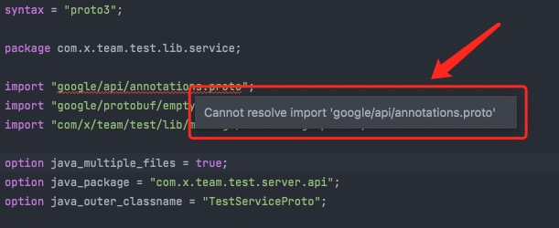
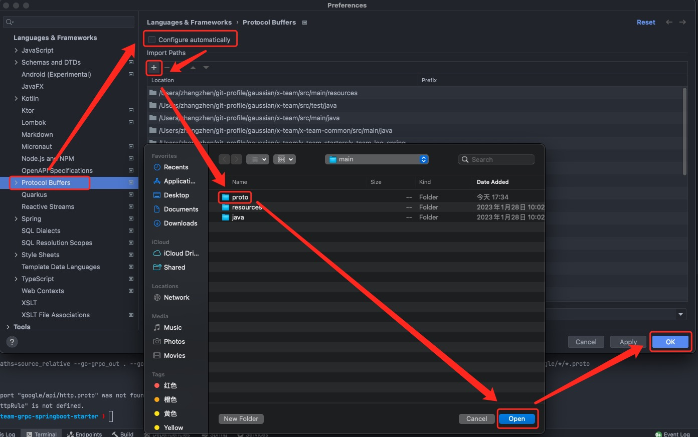

# 基础

+ 需要`maven`；
+ 需要`jdk11`;
+ 需要`envoy`；
+ 需要`redis`；
+ 需要`mysql8`；

```shell
$ vim ~/.bash_profile
# 设置 JDK 11
export JAVA_11_HOME=`/usr/libexec/java_home -v 11`
```

# ENVOY

[envoy教程](x-team-starters/x-team-grpc-springboot-starter/README.md)

# 安装 protobuf

### 1.下载地址：
`https://github.com/protocolbuffers/protobuf/releases`
有很多语言版本的，mac下选择第一个。

### 2.下载下来后解压压缩包，并进入目录
`$ cd protobuf-3.7.0/`

### 3.设置编译目录
`$ ./configure --prefix=/usr/local/protobuf`

### 4.切换到`root`用户
`$ sudo -i`

### 5.安装
`$ make && make install`

### 6.配置环境变量
找到用户目录`/Users/pauljiang` 的`.bash_profile`文件并编辑
`$ vim .bash_profile`
#### 添加：
+ `export PROTOBUF=/usr/local/protobuf`
+ `export PATH=$PROTOBUF/bin:$PATH`
+ `source`一下使文件生效
+ `$ source .bash_profile`

### 7.测试安装结果
`$ protoc --version`

# 在Intellij IDEA中使用 Protobuf
## 一、`.proto`文件语法高亮显示

需要安装`Protobuf Support`插件。

依次点击`Intellij`中的 `File` --> `Settings` --> `Plugins` --> `Browse repositories` ，

输入`Protobuf`，如下所示：



安装完后，重启`Intellij IDEA`，查看`.proto`文件，会发现已经支持语法高亮显示。

## 二、将 .proto 文件转成 Java 类

一般的做法，是执行`protoc`命令，依次将`.proto`文件转成`Java`类:

`protoc.exe -I=d:/tmp --java_out=d:/tmp d:/tmp/monitor_data.proto`

不过`GRPC`官方推荐了一种更优雅的使用姿势，可以通过`maven`轻松搞定

### 2.1 pom.xml文件配置

```xml
<properties>
    <grpc.version>1.6.1</grpc.version>
    <protobuf.version>3.3.0</protobuf.version>
</properties>
```

```xml
  <dependencies>
         <dependency>
            <groupId>io.grpc</groupId>
            <artifactId>grpc-netty</artifactId>
            <version>${grpc.version}</version>
            <scope>provided</scope>
        </dependency>
        <dependency>
            <groupId>io.grpc</groupId>
            <artifactId>grpc-protobuf</artifactId>
            <version>${grpc.version}</version>
            <scope>provided</scope>
        </dependency>
        <dependency>
            <groupId>io.grpc</groupId>
            <artifactId>grpc-stub</artifactId>
            <version>${grpc.version}</version>
            <scope>provided</scope>
        </dependency>
        <dependency>
            <groupId>com.google.protobuf</groupId>
            <artifactId>protobuf-java</artifactId>
            <version>${protobuf.version}</version>
        </dependency>
  </dependencies>
```

```xml
    <build>
        <extensions>
            <extension>
                <groupId>kr.motd.maven</groupId>
                <artifactId>os-maven-plugin</artifactId>
                <version>1.5.0.Final</version>
            </extension>
        </extensions>
        <plugins>
            <plugin>
                <groupId>org.xolstice.maven.plugins</groupId>
                <artifactId>protobuf-maven-plugin</artifactId>
                <version>0.5.0</version>
                <configuration>
                    <protocArtifact>com.google.protobuf:protoc:${protobuf.version}:exe:${os.detected.classifier}</protocArtifact>
                    <pluginId>grpc-java</pluginId>
                    <pluginArtifact>io.grpc:protoc-gen-grpc-java:${grpc.version}:exe:${os.detected.classifier}</pluginArtifact>
                </configuration>
                <executions>
                    <execution>
                        <goals>
                            <goal>compile</goal>
                            <goal>compile-custom</goal>
                        </goals>
                    </execution>
                </executions>
            </plugin>            
        </plugins>
    </build>
```

### 2.2 编译生成 Java 类

使用`maven`的编译命令，即可在`target`中看到根据`.proto`文件生成的`Java`类，如下所示：



### 三、遇到的坑

1.打开`.proto`文件后，显示`File not found`提示。

这种情况，一般是未设置`.proto`文件所在文件夹为源文件，可以进行如下设置：

在`.proto`文件所在的文件夹上右键，设置目录为源文件根目录，如下所示：



## 四、解决`google.api`的问题



**如图所示：** 当前如果引用，会出现`Cannot resolve`的问题；在使用的时候，其实不影响，但是影响美观；

### 解决方案：

如下图所示，按照步骤既能解决相关问题：



---

# Mac安装Docker

`$ brew install --cask --appdir=/Applications docker`

`docker-compose`一并安装了