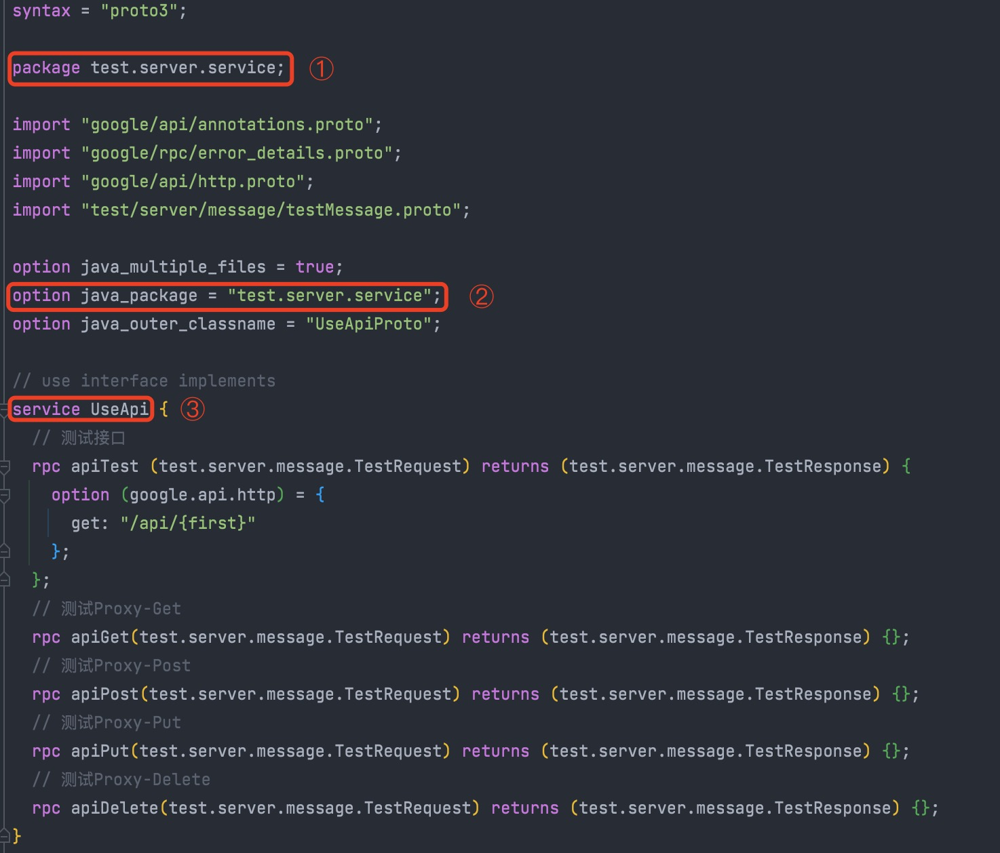

# test-server

实例服务

## test-lib

`grpc`的`proto`生成的代码`lib`

## test-grpc

服务`service`端

## 配置

```yaml
spring:
  # 数据库配置
  dataSource:
    username: test
    password: test123
    url: jdbc:mysql://dev-mysql:3388/test?serverTimezone=GMT%2B8&useUnicode=true&characterEncoding=utf-8&useSSL=false&nullCatalogMeansCurrent=true
  # redis配置
  redis:
    port: 6379
    password: 86zsEp
    host: dev-redis
    database: 10
# 毋需token的grpc方法配置
grpc:
  exclude:
    methods: admin.server.service.UseApi/api*,work.server.service.workApi/workDetail
```



**注：**
+ `①`和`②`需要保持一致；
+ `grpc.exclude.methods`配置，以`,`分割； 例如：`admin.server.service.UseApi`是`proto`文件中`① package`+`③ service`，具体方法和`method`需要用`/`分割。
+ 可用`*`的方式涵盖一组接口；
+ 例如：`admin.server.service.UseApi/api*`不拦截`admin.server.service.UseApi/apiTest`、`admin.server.service.UseApi/apiGet`、`admin.server.service.UseApi/apiPut`、`admin.server.service.UseApi/apiDelete`接口；
