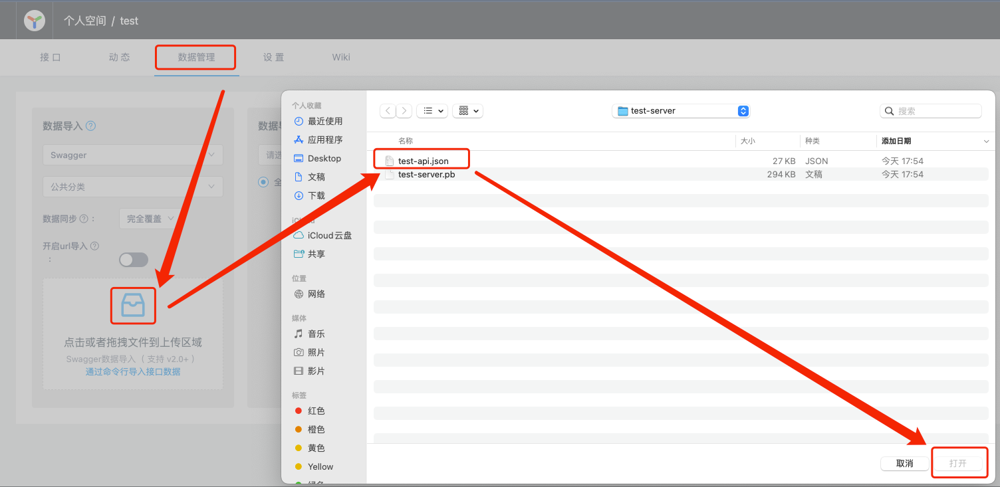

# lib

用来定义`gRPC`的`proto`文件。

---

## 示例：

所有`gRPC`对应的结构体都在: `src/main/proto/${application.name}/server/message`中。

---

### 请求响应对象：

+ `package`是：`${application.name}.server.message;`；
+ 必须添加：`option java_multiple_files = true;`；
+ `openapiv2_field`，按照示例编写；
+ `java_package`是`${application.name}.server.message`；
+ `java_outer_classname`是`${application.name}MessageProto`，首字母大写。
+ 参数均使用`_`(下划线)的方式命名，例如：`string first_id = 1;`；
+ 请求的`Suffix`是`Request`例如：`TestRequest`；
    + `Struct`使用首字母大写的驼峰，例如：`TestRequest`；
+ 响应的`Suffix`是`Response`，例如：`TestResponse`；
    + `Struct`使用首字母大写的驼峰，例如：`TestResponse`；

```protobuf
syntax = "proto3";

package test.server.message;

import "grpc/gateway/protoc_gen_openapiv2/options/annotations.proto";

option java_multiple_files = true;
option java_package = "test.server.message";
option java_outer_classname = "TestMessageProto";
option go_package = "x-team/test/server/message";

// 示例：https://raw.githubusercontent.com/grpc-ecosystem/grpc-gateway/master/examples/internal/proto/examplepb/a_bit_of_everything.proto
message TestRequest {

  option (grpc.gateway.protoc_gen_openapiv2.options.openapiv2_schema) = {
    json_schema: {
      title: "测试接口入参";
      description: "测试接口入参description";
      required: ["first_id"];
      type: OBJECT;
    };
  };

  string first_id = 1
  [(grpc.gateway.protoc_gen_openapiv2.options.openapiv2_field) = {
    title: "第一个参数";
    description: "第一个参数description";
    default: "first_id_default";
    type: STRING;
  }];

  bool second = 2
  [(grpc.gateway.protoc_gen_openapiv2.options.openapiv2_field) = {
    title: "第二个参数";
    description: "第二个参数description";
    default: "false";
    type: BOOLEAN;
  }];

  repeated Third third = 3
  [(grpc.gateway.protoc_gen_openapiv2.options.openapiv2_field) = {
    title: "第三个参数";
    description: "第三个参数description";
    type: ARRAY;
  }];
}

message Third {

  option (grpc.gateway.protoc_gen_openapiv2.options.openapiv2_schema) = {
    json_schema: {
      title: "测试接口入参第三个参数";
      description: "测试接口入参第三个参数description";
      type: OBJECT;
    }
  };

  string third_first = 1
  [(grpc.gateway.protoc_gen_openapiv2.options.openapiv2_field) = {
    title: "第三个参数的第一个参数";
    description: "第三个参数的第一个参数description";
    default: "third_first_param_default";
    type: STRING;
    max_length: 255;
  }];

  int32 third_second = 2
  [(grpc.gateway.protoc_gen_openapiv2.options.openapiv2_field) = {
    title: "第三个参数的第二个参数";
    description: "第三个参数的第二个参数description";
    default: "456";
    type: INTEGER;
    minimum: 1;
    maximum: 100;
  }];
}

message TestResponse {

  option (grpc.gateway.protoc_gen_openapiv2.options.openapiv2_schema) = {
    json_schema: {
      title: "测试接口出参";
      description: "测试接口出参description";
      type: OBJECT;
    };
  };

  string a = 1
  [(grpc.gateway.protoc_gen_openapiv2.options.openapiv2_field) = {
    title: "第一个返回参数";
    description: "第一个返回参数description";
    default: "third_first_param_default";
    type: STRING;
  }];

  int32 b = 2
  [(grpc.gateway.protoc_gen_openapiv2.options.openapiv2_field) = {
    title: "第二个返回参数";
    description: "第二个返回参数description";
    default: "456";
    type: INTEGER;
  }];
}

```

---

### 接口定义：

所有`gRPC`对应的接口都在: `src/main/proto/${application.name}/server/service`中。

+ 使用`envoy`做`protocol`转换；
+ 符合`google.api.http`的方式；
+ 开发前请参阅：[google-api](https://cloud.google.com/apis/design/naming_convention?hl=zh-cn);
+ `openapiv2_swagger`和`openapiv2_operation`，按照示例编写；
+ 引用：
    + `import "google/api/annotations.proto";`，原因略；
    + `import "google/api/http.proto"`，原因略；
    + `import "google/protobuf/empty.proto"`，原因略；
    + `import "test/server/message/testMessage.proto";`，引用对象；
    + `import "grpc/gateway/protoc_gen_openapiv2/options/annotations.proto";`，引用`swagger`；
+ `package`是：`${application.name}.server.service;`；
+ 必须添加：`option java_multiple_files = true;`；
+ 必须添加：`option java_generic_services = true;`；
+ `java_package`是`${application.name}.server.service`；
+ `java_outer_classname`是`${service-zoom}ApiProto`，首字母大写；
+ `service`定义：`${service-zoom}Api`，首字母大写，例如：`service UseApi {}`；
    + **注意：**  `java_outer_classname`和`service name`对应关系，多了`Proto`的尾缀；
+ 可以定义空入参或空出参，需要引用：`import "google/protobuf/empty.proto";`； 
    + 使用方法自行`google`的`proto3`的定义；
+ 其他接口定义请参阅：[google-api](https://cloud.google.com/apis/design/naming_convention?hl=zh-cn);

```protobuf
syntax = "proto3";

package test.server.service;

import "google/api/annotations.proto";
import "google/api/http.proto";
import "google/protobuf/empty.proto";
import "test/server/message/testMessage.proto";
import "grpc/gateway/protoc_gen_openapiv2/options/annotations.proto";

option java_multiple_files = true;
option java_generic_services = true;
option java_package = "test.server.service";
option java_outer_classname = "UseApiProto";
option go_package = "x-team/test/server/service";

option (grpc.gateway.protoc_gen_openapiv2.options.openapiv2_swagger) = {
  info: {
    title: "UserApi接口";
    version: "2.0";
    description: "这是一个测试";
    terms_of_service: "无服务条款";
    contact: {name: "MassAdobe", email: "massadobe8@gmail.com"};
    license: {name: "无"};
  };
  schemes: [HTTP, HTTPS];
  base_path: "http://127.0.0.1:8080";
};

service UseApi {

  rpc ApiTest (test.server.message.TestRequest) returns (test.server.message.TestResponse) {

    option (google.api.http) = {
      get: "/test-server/v1/useApi/apiTest";
    };

    option (grpc.gateway.protoc_gen_openapiv2.options.openapiv2_operation) = {
      summary: "测试接口";
      description: "这是一个测试接口的description";
      tags: ["UseApi"];
      parameters: {
        headers: {
          type: STRING;
          required: true;
          name: "Authorization";
          description: "请求用户验签TOKEN";
        };
      };
    };
  };

  rpc ApiGet(test.server.message.TestRequest) returns (test.server.message.TestResponse) {

    option (google.api.http) = {
      get: "/test-server/v1/useApi/apiGet/{first_id}";
    };

    option (grpc.gateway.protoc_gen_openapiv2.options.openapiv2_operation) = {
      summary: "测试Proxy-Get";
      description: "测试Proxy-Get的description";
      tags: ["UseApi"];
      parameters: {
        headers: {
          type: STRING;
          required: true;
          name: "Authorization";
          description: "请求用户验签TOKEN";
        };
      };
    };
  };

  rpc ApiGetOther(test.server.message.TestRequest) returns (test.server.message.TestResponse) {

    option (google.api.http) = {
      get: "/test-server/v1/useApi/apiGetOther/{first_id=firsts/*}";
    };

    option (grpc.gateway.protoc_gen_openapiv2.options.openapiv2_operation) = {
      summary: "测试Proxy-Get-Other";
      description: "测试Proxy-Get-Other的description";
      tags: ["UseApi"];
      parameters: {
        headers: {
          type: STRING;
          required: true;
          name: "Authorization";
          description: "请求用户验签TOKEN";
        };
      };
    };
  };

  rpc ApiPost(test.server.message.TestRequest) returns (test.server.message.TestResponse) {
    option (google.api.http) = {
      post: "/test-server/v1/useApi/apiPost/{first_id=firsts/*}";
      body: "*";
    };

    option (grpc.gateway.protoc_gen_openapiv2.options.openapiv2_operation) = {
      summary: "测试Proxy-Post";
      description: "测试Proxy-Post的description";
      tags: ["UseApi"];
      parameters: {
        headers: {
          type: STRING;
          required: true;
          name: "Authorization";
          description: "请求用户验签TOKEN";
        };
      };
    };
  };

  rpc ApiPut(test.server.message.TestRequest) returns (google.protobuf.Empty) {

    option (google.api.http) = {
      put: "/test-server/v1/useApi/apiPut/{first_id}";
      body: "*";
    };

    option (grpc.gateway.protoc_gen_openapiv2.options.openapiv2_operation) = {
      summary: "测试Proxy-Put";
      description: "测试Proxy-Put的description";
      tags: ["UseApi"];
      parameters: {
        headers: {
          type: STRING;
          required: true;
          name: "Authorization";
          description: "请求用户验签TOKEN";
        };
      };
    };
  };

  rpc ApiDelete(test.server.message.TestRequest) returns (google.protobuf.Empty) {
    option (google.api.http) = {
      delete: "/test-server/v1/useApi/apiDelete/{first_id}";
      body: "*";
    };

    option (grpc.gateway.protoc_gen_openapiv2.options.openapiv2_operation) = {
      summary: "测试Proxy-Delete";
      description: "测试Proxy-Delete的description";
      tags: ["UseApi"];
      parameters: {
        headers: {
          type: STRING;
          required: true;
          name: "Authorization";
          description: "请求用户验签TOKEN";
        };
      };
    };
  };

  rpc ApiSelfPost(test.server.message.TestRequest) returns (test.server.message.TestResponse) {

    option (google.api.http) = {
      post: "/test-server/v1/useApi/apiSelfPost/{first_id=firsts/*}:self";
      body: "*";
    };

    option (grpc.gateway.protoc_gen_openapiv2.options.openapiv2_operation) = {
      summary: "测试自定义Post";
      description: "测试自定义Post的description";
      tags: ["UseApi"];
      parameters: {
        headers: {
          type: STRING;
          required: true;
          name: "Authorization";
          description: "请求用户验签TOKEN";
        };
      };
    };
  };

  rpc ApiSelfPut(test.server.message.TestRequest) returns (google.protobuf.Empty) {
    option (google.api.http) = {
      put: "/test-server/v1/useApi/apiSelfPut/{first_id=firsts/*}:self";
      body: "*";
    };

    option (grpc.gateway.protoc_gen_openapiv2.options.openapiv2_operation) = {
      summary: "测试自定义Put";
      description: "测试自定义Put的description";
      tags: ["UseApi"];
      parameters: {
        headers: {
          type: STRING;
          required: true;
          name: "Authorization";
          description: "请求用户验签TOKEN";
        };
      };
    };
  };
}
```

---

### 结合 ENVOY 的 gRPC使用

#### ENVOY的使用：

[ENVOY-EXAMPLE](../../../x-team-starters/x-team-grpc-springboot-starter/README.md)

在`test-lib/src/main/proto`下的`pb.sh`，执行生成相关的`test-server.pb`和`test-api.json`；
+ `test-server.pb`：`envoy`的`http_transcode_grpc`需要使用；
+ `test-api.json`：`yapi`接口类使用(后期二开`yapi`，直接开启`url导入`)。

#### pb.sh 内容：

```shell
#!/bin/bash

## 常量
APPLICATION_NAME="test"

## 变量
target_path=$(pwd)

echo "----- INFO [CURRENT-PATH]: [$target_path] -----"

# open-api
# shellcheck disable=SC2225
mkdir -p ./grpc
cp -r ../../../../../../x-team-starters/x-team-grpc-springboot-starter/src/main/proto/grpc/gateway ./grpc
echo "----- INFO [OPENAPI HAS BEEN COPIED] -----"

## 到达mvn的目录
# shellcheck disable=SC2164
cd ../../../
export JAVA_HOME=$JAVA_11_HOME
mvn clean install

## 回到原始目录
# shellcheck disable=SC2164
cd "$target_path"

## 删除open-api文件
rm -rf ./grpc
echo "----- INFO [OPENAPI (ANNOTATIONS/OPEN-API-V2) HAS BEEN DELETED] -----"

## 先删除原来的PB和API文件
rm -rf ../../../../../../pb/$APPLICATION_NAME-server/*.pb
rm -rf ../../../../../../pb/$APPLICATION_NAME-server/*.json
echo "----- INFO [DELETED ORIGIN $APPLICATION_NAME-server.pb AND $APPLICATION_NAME-api.json] -----"

## 复制envoy的proto到目标文件夹下
# LDS
# shellcheck disable=SC2225
cp ../../../../../../x-team-starters/x-team-grpc-springboot-starter/src/main/proto/envoy/service/listener/v3/lds.proto \
./$APPLICATION_NAME/server/service/lds.proto
echo "----- INFO [ENVOY-LDS HAS BEEN COPIED] -----"

# RDS
# shellcheck disable=SC2225
cp ../../../../../../x-team-starters/x-team-grpc-springboot-starter/src/main/proto/envoy/service/route/v3/rds.proto \
./$APPLICATION_NAME/server/service/rds.proto
echo "----- INFO [ENVOY-RDS HAS BEEN COPIED] -----"

# CDS
# shellcheck disable=SC2225
cp ../../../../../../x-team-starters/x-team-grpc-springboot-starter/src/main/proto/envoy/service/cluster/v3/cds.proto \
./$APPLICATION_NAME/server/service/cds.proto
echo "----- INFO [ENVOY-CDS HAS BEEN COPIED] -----"

# EDS
# shellcheck disable=SC2225
cp ../../../../../../x-team-starters/x-team-grpc-springboot-starter/src/main/proto/envoy/service/endpoint/v3/eds.proto \
./$APPLICATION_NAME/server/service/eds.proto
echo "----- INFO [ENVOY-EDS HAS BEEN COPIED] -----"

# gRPC-Health
# shellcheck disable=SC2225
cp ../../../../../../x-team-starters/x-team-grpc-springboot-starter/src/main/proto/grpc/health/v1/health.proto \
./$APPLICATION_NAME/server/service/annotations.proto
echo "----- INFO [GRPC-HEALTH HAS BEEN COPIED] -----"

# gRPC-reflection
# shellcheck disable=SC2225
cp ../../../../../../x-team-starters/x-team-grpc-springboot-starter/src/main/proto/grpc/reflection/v1alpha/reflection.proto \
./$APPLICATION_NAME/server/service/reflection.proto
echo "----- INFO [GRPC-REFLECTION HAS BEEN COPIED] -----"

# gRPC-Health-Server
# shellcheck disable=SC2225
cp ../../../../../../x-team-starters/x-team-grpc-springboot-starter/src/main/proto/grpc/health/server/health.proto \
./$APPLICATION_NAME/server/service/healthServer.proto
echo "----- INFO [GRPC-HEALTH HAS BEEN COPIED] -----"

## 生成相关的"pb"文件，给envoy使用
echo ""
echo "----- INFO [DOING PROTOC PB] -----"
protoc -I ../../../../../../x-team-starters/x-team-grpc-springboot-starter/src/main/proto \
  -I ./ \
  --include_imports --include_source_info \
  --descriptor_set_out=../../../../../../pb/$APPLICATION_NAME-server/$APPLICATION_NAME-server.pb \
  ./$APPLICATION_NAME/server/service/*.proto
echo "----- INFO [NEW $APPLICATION_NAME-server.pb HAS BEEN GENERATED] -----"
echo ""

## 复制到envoy目录下
cp ../../../../../../pb/$APPLICATION_NAME-server/$APPLICATION_NAME-server.pb ~/docker/envoy-grpc-xds/pb/$APPLICATION_NAME-server.pb
echo "----- INFO [NEW $APPLICATION_NAME-server.pb HAS BEEN COPIED] -----"

## 删除envoy的proto文件
# shellcheck disable=SC1101
rm -rf ./$APPLICATION_NAME/server/service/lds.proto \
./$APPLICATION_NAME/server/service/rds.proto \
./$APPLICATION_NAME/server/service/cds.proto \
./$APPLICATION_NAME/server/service/eds.proto \
./$APPLICATION_NAME/server/service/health.proto \
./$APPLICATION_NAME/server/service/reflection.proto \
./$APPLICATION_NAME/server/service/annotations.proto \
./$APPLICATION_NAME/server/service/healthServer.proto
echo "----- INFO [ENVOY (LDS/RDS/CDS/EDS/HEALTH/REFLECTION) HAS BEEN DELETED] -----"

## 生成相关的"swagger-json"文件，给YAPI使用
echo ""
echo "----- INFO [DOING PROTOC SWAGGER] -----"
protoc -I ../../../../../../x-team-starters/x-team-grpc-springboot-starter/src/main/proto \
  -I ./ \
  --include_imports --include_source_info \
  --openapiv2_out ../../../../../../pb/$APPLICATION_NAME-server \
  --openapiv2_opt logtostderr=true \
  --openapiv2_opt allow_delete_body=true \
  --openapiv2_opt allow_merge=true \
  --openapiv2_opt generate_unbound_methods=true \
  --openapiv2_opt openapi_naming_strategy=fqn \
  ./$APPLICATION_NAME/server/service/*.proto
echo "----- INFO [NEW $APPLICATION_NAME-api.json HAS BEEN GENERATED] -----"
echo ""

## 转译api的文件json
# shellcheck disable=SC2224
mv ../../../../../../pb/$APPLICATION_NAME-server/apidocs.swagger.json ../../../../../../pb/$APPLICATION_NAME-server/$APPLICATION_NAME-api.json
echo "----- INFO [RENAME apidocs.swagger.json HAS BEEN RENAMED AS $APPLICATION_NAME-api.json] -----"

```

开辟新服务的时候，只需要修改：`APPLICATION_NAME="test"`即可；

---

### 结合 YAPI 的 gRPC使用

当执行了上一步的`pb.sh`后，会在项目下：`x-team/pb/${application-name}-server`下，生成`${application-name}-api.json`；

将上一步生成的`${application-name}-api.json`导入`yapi`中；

`yapi`是增量添加，无法删除，如果需要删除接口操作，需要手动删除。

