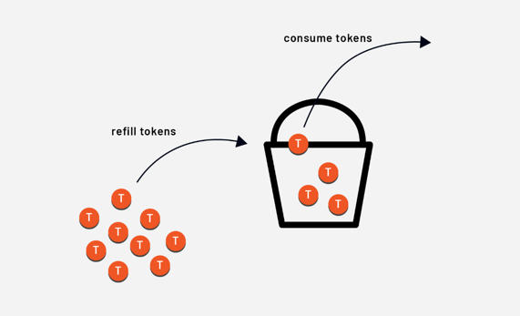
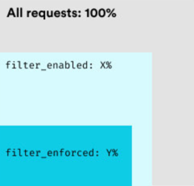

# envoy

`Envoy` 是开源的边缘和服务代理，用于云原生应用，云原生基金会 `CNCF` 项目。

## 特性

+ `OUT OF PROCESS ARCHITECTURE`：`Envoy` 是一款自包含的高性能服务器，具有很小的内存占用空间，它与任何应用程序语言或框架一起运行。
+ `HTTP/2 AND GRPC SUPPORT`：`Envoy` 对出入流量都有一流的 `HTTP/2` 和 `gRPC` 支持，它是一个透明的 `HTTP/1.1` 到 `HTTP/2` 代理。
+ `ADVANCED LOAD BALANCING`：`Envoy` 支持高级负载均衡功能，包括自动重试、断路、全局速率限制、请求镜像和区域本地负载均衡等。
+ `APIS FOR CONFIGURATION MANAGEMENT`：`Envoy` 提供强大的 `API` 来动态管理其配置。
+ `OBSERVABILITY`：深入观察 `L7` 流量，原生支持分布式跟踪，以及 `MongoDB`、`DynamoDB` 等的线级可观察性。

## 文档：

> [envoy官方文档](https://www.envoyproxy.io/docs/envoy/v1.21.6/search.html)
>> 尽量去阅读了解一下`envoy`相关概念。

> [envoy基金会基础教程](https://academy.tetrate.io/)
>> 可以结合基础教程做操作，其中有许多的坑，需要结合官方文档以及其`github`中开源的项目揣测。

## 简介

> ### 什么是 Envoy？
>> 行业正在向微服务架构和云原生解决方案发展。由于使用不同的技术开发了成百上千的微服务，这些系统可能变得复杂，难以调试。
>
>> 作为一个应用开发者，你考虑的是业务逻辑——购买产品或生成发票。然而，任何像这样的业务逻辑都会导致不同服务之间的多个服务调用。每个服务可能都有它的超时、重试逻辑和其他可能需要调整或微调的网络特定代码。
>
>> 如果在任何时候最初的请求失败了，就很难通过多个服务来追踪，准确地指出失败发生的地方，了解请求为什么失败。是网络不可靠吗？是否需要调整重试或超时？或者是业务逻辑问题或错误？
>
>> 服务可能使用不一致的跟踪和记录机制，使这种调试的复杂性增加。这些问题使你很难确定问题发生在哪里，以及如何解决。如果你是一个应用程序开发人员，而调试网络问题不属于你的核心技能，那就更是如此。
>
>> 将网络问题从应用程序堆栈中抽离出来，由另一个组件来处理网络部分，让调试网络问题变得更容易。这就是 `Envoy` 所做的事情。
>
>> 在每个服务实例旁边都有一个 `Envoy` 实例在运行。这种类型的部署也被称为 Sidecar 部署。`Envoy` 的另一种模式是边缘代理，用于构建 `API` 网关。
>
>> `Envoy` 和应用程序形成一个原子实体，但仍然是独立的进程。应用程序处理业务逻辑，而 `Envoy` 则处理网络问题。
>
>> 在发生故障的情况下，分离关注点可以更容易确定故障是来自应用程序还是网络。
>
>> 为了帮助网络调试，`Envoy` 提供了以下高级功能。

> ### 进程外架构
>> `Envoy` 是一个独立的进程，旨在与每个应用程序一起运行 —— 也就是我们前面提到的 `Sidecar` 部署模式。集中配置的 `Envoy` 的集合形成了一个透明的服务网格。
>
>> 路由和其他网络功能的责任被推给了 `Envoy`。应用程序向一个虚拟地址（`localhost`）而不是真实地址（如公共 `IP` 地址或主机名）发送请求，不知道网络拓扑结构。应用程序不再承担路由的责任，因为该任务被委托给一个外部进程。
>
>> 与其让应用程序管理其网络配置，不如在 Envoy 层面上独立于应用程序管理网络配置。在一个组织中，这可以使应用程序开发人员解放出来，专注于应用程序的业务逻辑。
>
>> `Envoy` 适用于任何编程语言。你可以用 `Go`、`Java`、`C++` 或其他任何语言编写你的应用程序，而 `Envoy` 可以在它们之间架起桥梁。`Envoy` 的行为是相同的，无论应用程序的编程语言或它们运行的操作系统是什么。
>
>> `Envoy` 还可以在整个基础设施中透明地进行部署和升级。这与为每个单独的应用程序部署库升级相比，后者可能是非常痛苦和耗时的。
>
>> 进程外架构是有益的，因为它使我们在不同的编程语言 / 应用堆栈中保持一致，我们可以免费获得独立的应用生命周期和所有的 Envoy 网络功能，而不必在每个应用中单独解决这些问题。

> ### L3/L4 过滤器结构
>> `Envoy` 是一个 `L3/L4` 网络代理，根据 `IP` 地址和 `TCP` 或 `UDP` 端口进行决策。它具有一个可插拔的过滤器链，可以编写你的过滤器来执行不同的 `TCP/UDP` 任务。
>
>> 过滤器链（`Filter Chain`） 的想法借鉴了 `Linux shell`，即一个操作的输出被输送到另一个操作中。例如：
>
>> ` ls -l | grep "Envoy*.cc" | wc -l`
>
>> `Envoy` 可以通过堆叠所需的过滤器来构建逻辑和行为，形成一个过滤器链。许多过滤器已经存在，并支持诸如原始 `TCP` 代理、`UDP` 代理、`HTTP` 代理、`TLS` 客户端认证等任务。`Envoy` 也是可扩展的，我们可以编写我们的过滤器。

> ### L7 过滤器结构
>> `Envoy` 支持一个额外的 `HTTP L7` 过滤器层。我们可以在 HTTP 连接管理子系统中插入 `HTTP` 过滤器，执行不同的任务，如缓冲、速率限制、路由 / 转发等。

> ### 一流的 HTTP/2 支持
>> `Envoy` 同时支持 `HTTP/1.1` 和 `HTTP/2`，并且可以作为一个透明的 `HTTP/1.1` 到 `HTTP/2` 的双向代理进行操作。这意味着任何 `HTTP/1.1` 和 `HTTP/2` 客户端和目标服务器的组合都可以被桥接起来。即使你的传统应用没有通过 `HTTP/2` 进行通信，如果你把它们部署在 `Envoy` 代理旁边，它们最终也会通过 `HTTP/2` 进行通信。
>
>> 推荐在所有的服务间配置的 `Envoy` 使用 `HTTP/2`，以创建一个持久连接的网格，请求和响应可以在上面复用。

> ### HTTP 路由
>> 当以 `HTTP` 模式操作并使用 `REST` 时，`Envoy` 支持路由子系统，能够根据路径、权限、内容类型和运行时间值来路由和重定向请求。在将 `Envoy` 作为构建 `API` 网关的前台 / 边缘代理时，这一功能非常有用，在构建服务网格（`sidecar` 部署模式）时，也可以利用这一功能。

> ### gRPC 准备就绪
>> `Envoy` 支持作为 `gRPC` 请求和响应的路由和负载均衡底层所需的所有 `HTTP/2` 功能。
>
>> `gRPC` 是一个开源的远程过程调用（`RPC`）系统，它使用 `HTTP/2` 进行传输，并将协议缓冲区作为接口描述语言（`IDL`），它提供的功能包括认证、双向流和流量控制、阻塞 / 非阻塞绑定，以及取消和超时。

> ### 服务发现和动态配置
>> 我们可以使用静态配置文件来配置 `Envoy`，这些文件描述了服务间通信方式。
>
>> 对于静态配置 `Envoy` 不现实的高级场景，`Envoy` 支持动态配置，在运行时自动重新加载配置。一组名为 `xDS` 的发现服务可以用来通过网络动态配置 `Envoy`，并为 `Envoy` 提供关于主机、集群 `HTTP` 路由、监听套接字和加密信息。

> ### 健康检查
>> 负载均衡器有一个特点，那就是只将流量路由到健康和可用的上游服务。`Envoy` 支持健康检查子系统，对上游服务集群进行主动健康检查。然后，`Envoy` 使用服务发现和健康检查信息的组合来确定健康的负载均衡目标。`Envoy` 还可以通过异常点检测子系统支持被动健康检查。

> ### 高级负载均衡
>> `Envoy` 支持自动重试、断路、全局速率限制（使用外部速率限制服务）、影子请求（或流量镜像）、异常点检测和请求对冲。

> ### 前端 / 边缘代理支持
>> `Envoy` 的特点使其非常适合作为边缘代理运行。这些功能包括 `TLS` 终端、`HTTP/1.1`、`HTTP/2` 和 `HTTP/3` 支持，以及 `HTTP L7` 路由。

> ### TLS 终止
>> 应用程序和代理的解耦使网格部署模型中所有服务之间的 `TLS` 终止（双向 `TLS`）成为可能。

> ### 一流的可观察性
>> 为了便于观察，`Envoy` 会生成日志、指标和追踪。`Envoy` 目前支持 `statsd`（和兼容的提供者）作为所有子系统的统计。得益于可扩展性，我们也可以在需要时插入不同的统计提供商。

> ### HTTP/3 (Alpha)
>> `Envoy 1.19.0` 支持 `HTTP/3` 的上行和下行，并在 `HTTP/1.1`、`HTTP/2` 和 `HTTP/3` 之间进行双向转义。

## 项目中使用的 envoy

**注：** 当前教程只针对`Mac OS`进行描述。

### docker 安装：

下载`dmg`：[下载地址](https://docs.docker.com/desktop/install/mac-install/)

`Mac OS`下载的`docker`一般都涵盖`docker-compose`；

查看安装是否成功：

```text
# 命令：查看docker安装情况
$ docker version
Client:
 Cloud integration: v1.0.20
 Version:           20.10.10
 API version:       1.41
 Go version:        go1.16.9
 Git commit:        b485636
 Built:             Mon Oct 25 07:43:15 2021
 OS/Arch:           darwin/amd64
 Context:           default
 Experimental:      true

Server: Docker Engine - Community
 Engine:
  Version:          20.10.10
  API version:      1.41 (minimum version 1.12)
  Go version:       go1.16.9
  Git commit:       e2f740d
  Built:            Mon Oct 25 07:41:30 2021
  OS/Arch:          linux/amd64
  Experimental:     false
 containerd:
  Version:          1.4.11
  GitCommit:        5b46e404f6b9f661a205e28d59c982d3634148f8
 runc:
  Version:          1.0.2
  GitCommit:        v1.0.2-0-g52b36a2
 docker-init:
  Version:          0.19.0
  GitCommit:        de40ad0
 
# 命令：查看docker-compose
$ docker-compose -v
docker-compose version 1.29.2, build 5becea4c
```

其他`docker`命令自行`google`。

### 本地(native)

已解决相关`envoy`的`gRPC`健康检查，同时解决关于`xDS`中的：

+ `LDS`;
+ `RDS`;
+ `CDS`;
+ `EDS`
  的配置。

### 本地安装 NACOS

略。

`nacos`配置：

+ 添加命名空间：名称：`x-team`；空间`ID`：`x-team`；
+ 在`x-team`空间下创建配置；
+ 注意一下`native`环境中连接`nacos`的`username`和`password`，目前设置的是`gaussian`和`gaussian`;
+ 本地`/etc/hosts`添加：`127.0.0.1        host.docker.internal`。

#### 配置
> **ROUTE-CONFIGURATION:**
>> DataId: route.yml
> 
>> Group: X-TEAM
> 
> ```yaml
> # GRPC连接池
> grpc:
>   client:
>   test-server:
>     address: dns:/127.0.0.1:16001
>```

> **SERVER-CONFIGURATION:**
>> DataId: test-server.yml
> 
>> Group: DEFAULT_GROUP
>
> ```yaml
>  spring:
>    # 数据库配置
>    dataSource:
>      username: test
>      password: test123
>      url: jdbc:mysql://172.17.110.108:3388/test?serverTimezone=GMT%2B8&useUnicode=true&characterEncoding=utf-8&useSSL=false&nullCatalogMeansCurrent=true
>  # redis配置
>  redis:
>     port: 6379
>     password: 86djeiJJ
>     host: 127.0.0.1
>     database: 0
>  # 过滤不用拦截的接口
>  web:
>    # 速率(默认)
>    rate-limit:
>      # 最大令牌数
>      max-tokens: 100
>      # 填充时间(秒)
>      fill-interval: 1
>      # 填充时间内添加的令牌数
>      tokens-per-fill: 100
>  # 过滤不用拦截的接口(按照顺序拦截)
>  exclude-urls:
>    # 接口名称
>    api:
>      url: 'test.server.service.UseApi/ApiTest'
>      # 限速配置
>      rate-limit:
>        max-tokens: 1
>        fill-interval: 5
>        tokens-per-fill: 1
>    api1:
>      url: 'test.server.service.UseApi/ApiGet'
>      # 限速配置
>      rate-limit:
>        max-tokens: 1
>        fill-interval: 2
>        tokens-per-fill: 1
>    api2:
>      url: 'test.server.service.UseApi/ApiGetOther'
>      rate-limit:
>        max-tokens: 123
>        fill-interval: 22
>        tokens-per-fill: 32
>   api3:
>      # 限速配置为空
>      url: 'test.server.service.UseApi/ApiPost'
>```

#### 配置解析

##### `web.rate-limit`是配置调用限流的配置

局部速率限制过滤器对过滤器链处理的传入连接应用一个令牌桶速率限制。

令牌桶算法的基础是令牌在桶中的类比。桶里的令牌以一个固定的速度被重新填满。每次收到一个请求或连接时，我们都会检查桶里是否还有令牌。如果有，就从桶中取出一个令牌，然后处理该请求。如果没有剩余的令牌，该请求就会被放弃（即速率限制）。



局部速率限制可以在监听器层面或虚拟主机或路由层面进行全局配置，就像全局速率限制一样。我们还可以在同一配置中结合全局和局部速率限制。

`token_bucket` 指定了过滤器处理的请求所使用的配置。它包括桶可以容纳的最大令牌数量（`max_tokens`），每次填充的令牌数量（`tokens_per_refill`）以及填充间隔（`fill_interval`）。

下面是一个最多可以容纳 `5000` 个令牌的桶的配置实例。每隔 `30` 秒，向桶中添加 `100` 个令牌。桶中的令牌容量永远不会超过 `5000`。

为了控制令牌桶是在所有 `worker` 之间共享（即每个 `Envoy` 进程）还是按连接使用，我们可以设置 `local_rate_limit_per_downstream_connection` 字段。默认值是 `false`，这意味着速率限制被应用于每个 `Envoy` 进程。

控制是否启用或强制执行某一部分请求的速率限制的两个设置被称为 `filter_enabled和` `filter_enforced`。这两个值在默认情况下都设置为 `0%`。

速率限制可以被启用，但不一定对一部分请求强制执行。例如，我们可以对 `50%` 的请求启用速率限制。然后，在这 50% 的请求中，我们可以强制执行速率限制。



#### 过滤不用拦截的接口

**注意：**按照顺序拦截

配置中有：`name`下有：
+ `url`；
+ `rate-limit` 下有；
    + `max-tokens`；
    + `fill-interval`；
    + `tokens-per-fill`；

如果不配置`rate-limit`，那么默认使用`web.rate-limit`的配置限流。
    
##### 顺序拦截

如上配置示例，匹配拦截书序为：
+ ① `api`；
+ ② `api1`；
+ ③ `api2`；
+ ④ `api3`；

##### `url`使用的是前缀配置，且需要配置`proto`的方法调用定义：

前缀匹配含义:

例如：`url`：`/a123/b123/c123/d123`；

如果配置：`/a123`

即 可以匹配到 `/a123/b123/c123/d123`、`/a123/b123/c123`、`/a123/b123`、`/a123/b456/c345/d789`、...

如果配置：`/a123/b12`

即 可以匹配到 `/a123/b123/c123/d123`、`/a123/b123/c123`、`/a123/b125`、`/a123/b126xxxx/c345/d789`、...

##### `gRPC`方法路径：例如：

```protobuf
package test.server.service;

option java_package = "test.server.service";
option java_outer_classname = "TestApiProto";

service TestApi {
  // 测试接口
  rpc Testing (TestRequest) returns (TestResponse) {
    option (google.api.http) = {
      get: "/test-server/v1/testApi/testing/{first_id=firsts/*}"
    };
  };
}
```

上面示例中，实际`测试接口`对应的`proto`的接口路由路径为：`test.server.service.TestApi/Testing`。

#### 启动框架的配置

+ 创建文件夹：`$ mkdir -p ~/docker/envoy/envoy-grpc-xds`;
+ 进入目录：`$ cd ~/docker/envoy/envoy-grpc-xds`;
+ 目录结构如下，主要关注`docker-compose.yml`和`envoy.yaml`;
+ 启用`admin`接口：`curl 'http://127.0.0.1:10417/config_dump?resources=routers' >> out.json`;

```text
envoy-grpc-xds
├── docker-compose.yml
├── envoy.yaml
├── logs
│      ├── access_log.2023-02-15.log
│      └── access_log.2023-02-16.log
├── out.json
├── pb
│   └── test-server.pb
└── work
    └── Tomcat
        └── localhost
            └── nacos
```

**`docker-compose.yml`:**

```yaml
version: '3.3'

services:
  envoy:
    container_name: envoy-grpc-xds
    image: envoyproxy/envoy-alpine:v1.21.6
    ports:
      - "10408:10408"
      - "10417:10417"
    volumes:
      - ./envoy.yaml:/etc/envoy/envoy.yaml
      - ./pb/:/etc/envoy/pb/
    networks:
      envoymesh:
        aliases:
          - envoy-network

networks:
  envoymesh:
    driver: bridge
  host:
    external: true
```

**envoy.yaml:**

启动命令：`$ docker-compose up -d`;

停止命令：`$ docker-compose down`;

其他命令请自行`google`。

```yaml
node:
  # ID根据不同服务进行修改
  id: envoy-test-01
  # 名称根据不同服务进行修改
  cluster: envoy-test-server-cluster

admin:
  address:
    socket_address:
      address: 0.0.0.0
      port_value: 10417
  access_log:
    - name: envoy.access_loggers.file
      typed_config:
        "@type": type.googleapis.com/envoy.extensions.access_loggers.stream.v3.StdoutAccessLog

dynamic_resources:
  lds_config:
    resource_api_version: V3
    api_config_source:
      api_type: GRPC
      transport_api_version: V3
      grpc_services:
        envoy_grpc:
          # 名称根据不同服务进行修改
          cluster_name: test-server-xds
  cds_config:
    resource_api_version: V3
    api_config_source:
      api_type: GRPC
      transport_api_version: V3
      grpc_services:
        envoy_grpc:
          # 名称根据不同服务进行修改
          cluster_name: test-server-xds

static_resources:
  clusters:
    # 名称根据不同服务进行修改
    - name: test-server-xds
      connect_timeout: 10s
      type: LOGICAL_DNS
      http2_protocol_options: { }
      lb_policy: ROUND_ROBIN
      load_assignment:
        # 名称根据不同服务进行修改
        cluster_name: test-server-xds
        endpoints:
          - lb_endpoints:
              - endpoint:
                  address:
                    # 这里的端口号需要根据不同服务的端口号进行变动
                    socket_address: { address: host.docker.internal, port_value: 16001 }
```

### 其他环境(other environments)

略
