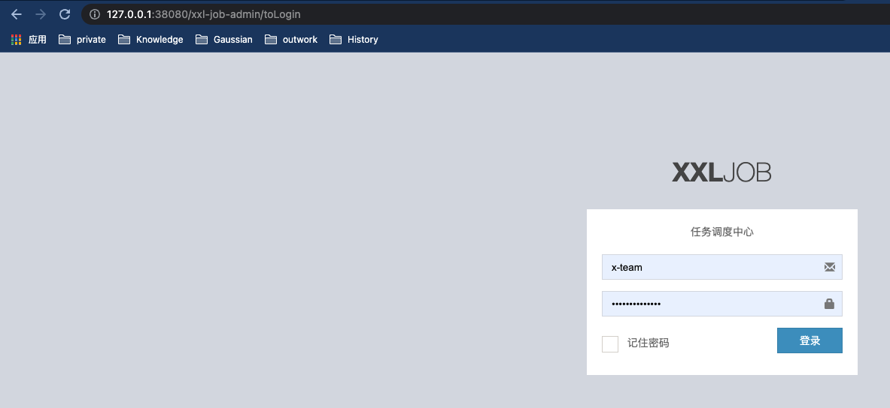
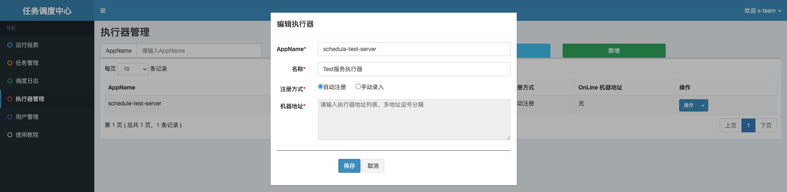
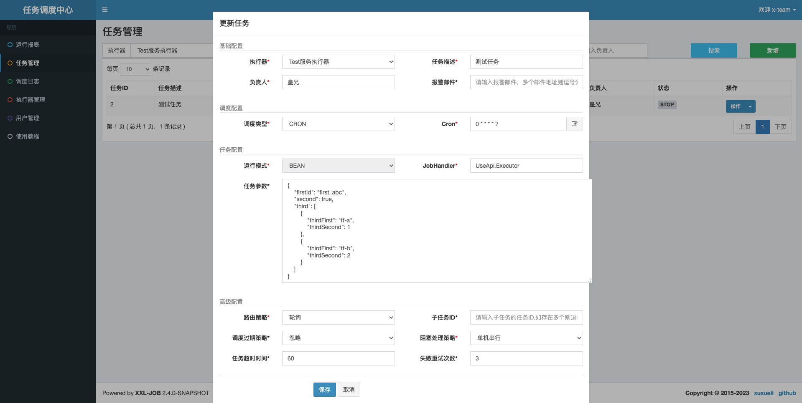
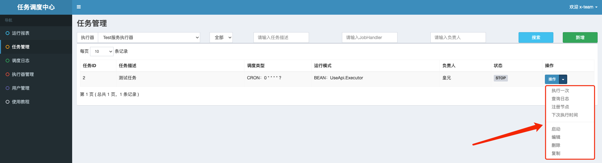

# schedule详细解释

[xxl-job概览](../../x-team-xxl-job/README.md)

[xxl-job-admin配置](../../x-team-xxl-job/xxl-job-admin/README.md)

## 使用方式：

在对应的项目中添加坐标：

### 配置：

```xml
<!-- 自研定时任务装配 -->
<dependency>
    <groupId>com.x.team</groupId>
    <artifactId>x-team-schedule-springboot-starter</artifactId>
</dependency>
```

在对应服务的`NACOS`中配置：

```yaml
### 注册到调度中心
xxl:
  job:
    executor:
      # 调度中心部署跟地址 [选填]：如调度中心集群部署存在多个地址则用逗号分隔。执行器将会使用该地址进行"执行器心跳注册"和"任务结果回调"；为空则关闭自动注册；
      adminAddresses: http://127.0.0.1:38080/xxl-job-admin
      # 执行器注册 [选填]：优先使用该配置作为注册地址，为空时使用内嵌服务 ”IP:PORT“ 作为注册地址。从而更灵活的支持容器类型执行器动态IP和动态映射端口问题。
      address: ''
```

### 启动：

#### 启动XXL-JOB-ADMIN

入口：`x-team-xxl-job/xxl-job-admin/src/main/java/com.xxl.job.admin.XxlJobAdminApplication.java`

在浏览器中输入：`http://127.0.0.1:38080/xxl-job-admin/toLogin`：



##### 新增执行器



**注意：**
+ `AppName`: `schedule`+`${spring.application.name}`；
+ 名称：解释一下相关服务；
+ 注册方式：选择`自动注册`。

##### 添加任务



**注意：**
+ 选择执行器；
+ 任务描述：描述定时器任务；
+ 负责人：填入自己的花名，后期可以与工作软件相关联；
+ 报警邮件：暂未开发；
+ 调度类型：`CRON`；
+ `Cron`：填入`cron`表达式；
+ 运行模式：`BEAN`；
+ `JobHandler`：详见`test-server/test-schedule`项目；
+ 任务参数：详见`test/server/test-schedule`项目；
+ 路由策略等。

##### 开启任务

自行研究：

